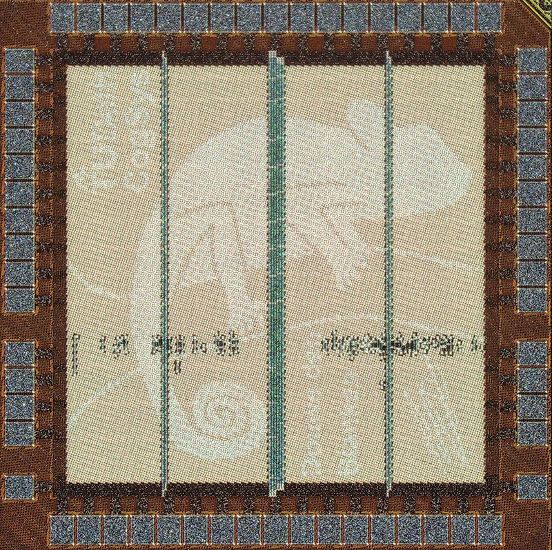

<p align="center">
    
</p>

# Chameleon: A MatMul-Free TCN Accelerator for End-to-End Few-Shot and Continual Learning from Sequential Data

Chameleon is the first chip carrying out end-to-end FSL and CL with temporal data (no off-chip embedder, all weights on-chip), with three key innovations all validated in silicon:

1) Chameleon builds on a reformulation of Prototypical Networks to integrate FSL/CL directly as part of the inference process, with only 0.5% logic area and negligible latency/power overheads. Simple yet powerful: we show the first 250-class demonstration of CL with Omniglot, also exceeding the accuracy of previous FSL-only demonstrations.

2) Chameleon uses temporal convolutional networks (TCNs) as an efficient embedder for temporal data. This choice simultaneously enables (i) accuracy/power performance on-par or exceeding state-of-the-art inference-only accelerators for keyword spotting (93.3% at 3.1μW real-time power on Google Speech Commands), and (ii) efficiently dealing with >10^4 context lengths, demonstrating competitive performance also when directly processing 16kHz *raw* audio (demonstrated for the first time end-to-end on-chip, to the best of our knowledge).

3) Small or large on-chip TCN? Learning- or inference-focused execution? Emphasis on throughput or low static power? Chameleon can efficiently support all of these application-dependent choices, thanks to a reconfigurable PE array.

In case you decide to use the Chameleon source code for academic or commercial use, we would appreciate it if you let us know; feedback is welcome.

## Directory structure

- [`src/`](src/): RTL (Verilog) source code
- [`scripts/`](scripts/): Scripts for Verilog formatting and configs for various waveviewers 
- [`chameleon/`](chameleon/)
    - [`core/`](core/): Core Python code to load and run trained nets and to communicate with the ASIC.
    - [`fpga_bridge/`](fpga_bridge/): Python code that runs on the FPGA to interface with the ASIC.
    - [`sim/`](sim/): Simulation code for the ASIC.
- [`nets/`](nets/): Pre-trained networks in quantized state dict format used in the experiments.

## Installation

### Verilog

Run: `bender update` to install the necessary Verilog dependencies. Always run `make` to generate all required Verilog code before synthesizing or simulating the hardware.

### Python

To use only the core Python code from Chameleon, simply run `pip install .` from the project root. If you also want to use the FPGA bridge code, run `pip install . [fpga_bridge]`. Finally, if you want to run the simulation code, run `pip install . [sim]`.

## Testing

Chameleon is tested using the [`cocotb`](https://www.cocotb.org/) framework. To run all full system tests, go into the `test/` directory and run:

```bash
python test_chameleon.py
```

To run the tests for individual components, run:

```bash
python test_pe.py
python test_pe_array.py
python test_argmax_tree.py
```

## From PyTorch training to silicon deployment (or simulation)

### 1. Train a TCN

Install the required package for TCN networks from [here](https://github.com/V0XNIHILI/TCN-library).

```python
from tcn_lib import TCN

# Model for sequential MNIST task (1 input, 10 outputs, 8 layers of 32 channels, kernel size 7)
model = TCN(1, 10, [32] * 8, 7)

# Perform training in any way you want

dataset = ...

for epoch in range(10):
    for batch in dataset:
        ...
        loss = ...
        loss.backward()
        ...
        optimizer.step()
        ...
```

All experiments described in our paper were conducted using our fully open-source [AutoLightning](https://github.com/V0XNIHILI/autolightning) framework, which builds on [PyTorch Lightning](https://github.com/Lightning-AI/pytorch-lightning) while adding support for detailed hyperparameter tracking, sweeping, and specialized training recipes, such as prototypical learning and quantization-aware training. However, you can of course use any framework you like to train your TCN model.

### 2. Quantize the network and export it

Install the required package for configurable quantization-aware-training from [here](https://github.com/V0XNIHILI/brevitas-utils).

```python
from brevitas_utils import create_qat_ready_model, get_quant_state_dict, save_quant_state_dict, QuantConfig

WEIGHT_BIT_WIDTH = 4
ACT_BIT_WIDTH = 4
BIAS_BIT_WIDTH = 15
ACCUMULATION_BIT_WIDTH = 18

# Define quantization configurations (see for more details: https://xilinx.github.io/brevitas/tutorials/tvmcon2021.html#Inheriting-from-a-quantizer)
weight_quant_cfg = QuantConfig(
    base_classes=["Int8WeightPerTensorPowerOfTwo"],
    kwargs={"bit_width": WEIGHT_BIT_WIDTH, "narrow_range": False}
)
act_quant_cfg = QuantConfig(
    base_classes=["ShiftedParamFromPercentileUintQuant"],
    kwargs={"bit_width": ACT_BIT_WIDTH, "collect_stats_steps": 1500}
)
bias_quant_cfg = QuantConfig(
    base_classes= ["Int16Bias"],
    kwargs={"bit_width": BIAS_BIT_WIDTH}
)

# Make sure to define output quantization in case of prototypical training
output_quant_cfg = None

load_float_weights_into_model = True # Reuse weights from the floating point model
calibration_setup = None # Do not calibrate (via: https://xilinx.github.io/brevitas/tutorials/tvmcon2021.html#Calibration-based-post-training-quantization) the model. Optionally configure for better model performance and/or faster convergence
skip_modules = [] # Quantize all modules

# Create a QAT-ready model
qat_ready_model = create_qat_ready_model(model,
                                         weight_quant_cfg,
                                         act_quant_cfg,
                                         bias_quant_cfg,
                                         load_float_weights_into_model=load_float_weights_into_model,
                                         calibration_setup=calibration_setup,
                                         skip_modules=skip_modules)

# Retrain for a few more epochs with a smaller learning rate to recover accuracy

# Get quantized weights and biases
quant_state_dict = get_quant_state_dict(qat_ready_model, (1, 1, 100))

# Export model
save_quant_state_dict(quant_state_dict, "quant_model.pkl")
```

### 3. Simulate the network

### 3.1 Simulate network with NumPy

We use Numpy primitives to simulate the network instead of PyTorch, as the Python code of this project has to run on the ARM core of the FPGA as well and PyTorch is likely a bit too heavy for that.

```python
from chameleon.core.net_transfer_utils import get_quant_state_dict_and_layers

path = "quant_model.pkl"  # Path to the exported quantized model

in_quant, quant_layers = get_quant_state_dict_and_layers(path)

dataset = ...  # Load your dataset here

accuracy, preds_and_targets = infer(path, dataset)

print(f"Accuracy: {accuracy}")
```

Note that when simulating the network like this, no limits are enforced on the number of layers and the width of the layers. Only the accumulation width is enforced.

### 3.2 Simulate network on-chip

```python
# TO DO!
```

### 4. Deploy the network

### FPGA acting as host

#### Setup at Delft University of Technology

To configure the power supply and the current measurement unit correctly, run the following commands after booting the FPGA:

```bash
sudo ip addr add xxx.yyy.z.p/qq dev eth1
ifconfig eth1 up
```

Then navigate to the location of this repository on the FPGA and run:

```
python -m asyncio
```

To start Python session to interact with Chameleon.

## Configuration

All memories are accessible for both read and write operations via the system’s 32-bit SPI bus (1 R/W-bit, 4-bit memory index, 16-bit start address, 11-bit transaction count).

This same SPI bus is also used to program the SoC’s configuration registers, such as the number of layers and kernel size per layer. These configuration values serve, among other things, as inputs to the network address generator, which generates the necessary control signals and memory addresses during processing.

A full list of configuration registers is provided below. If you want to change the configuration of the chip, edit the [`config_memory.json`](src/config_memory.json) file in the source code directory and rerun `make` to regenerate the associated Verilog code.

| **Name**                                   | **Width**                    | **Vector Size** | **Async Reset** | **Description**                                                                 |
|--------------------------------------------|------------------------------|------------------|------------------|---------------------------------------------------------------------------------|
| `continuous_processing`                    | 1                            | –                | ✅               | Enables processing (classification/regression) processing every few inputs for continuous streaming inputs.                                             |
| `classification`                           | 1                            | –                | ✅               | Enables classification mode.                                                   |
| `power_down_memories_while_running`        | 1                            | –                | ✅               | If you have a very high dimensional input or are transferring data into Chameleon very slowly, you can enable this flag. This will power down all memories except for the input memory while receiving input data. As soon as the necessary input data for a new set of computations is received, all memories will be powered up and the computation will be started.                                 |
| `enable_clock_divider`                     | 1                            | –                | ✅               | Enables clock division (off by default to save power).                                       |
| `ring_oscillator_stage_selection`          | 6                            | –                | ❌               | Selects number of stages in ring oscillator.                                   |
| `max_weight_address`                       | `WEIGHT_ADDRESS_WIDTH`       | –                | ❌               | The maximum weight index uses by the DNN during PNs                                     |
| `max_bias_address`                         | `BIAS_ADDRESS_WIDTH`         | –                | ✅               | Sets maximum addressable bias index.                                           |
| `shots`                                    | `SHOT_BIT_WIDTH`             | –                | ✅               | Number of shots for FSL.                     |
| `few_shot_scale`                           | `FEW_SHOT_SCALE_WIDTH`       | –                | ✅               | Scaling factor to scale summed embeddings into the range of weights during FSL.                                          |
| `k_shot_division_scale`                    | `K_SHOT_SCALE_WIDTH`         | –                | ✅               | Scale factor to divide `k` in FSL.                                      |
| `use_l2_for_few_shot`                      | 1                            | –                | ✅               | Selects L2 distance in FSL. Otherwise dot-product is used.                                 |
| `continued_learning`                       | 1                            | –                | ✅               | Enables continued learning mode to enable FSCIL.                                               |
| `fill_input_memory`                        | 1                            | –                | ✅               | Forces Chameleon to always fill the input memory before proceeding with processing.                                                   |
| `force_downsample`                         | 1                            | –                | ✅               | Forces a downsampling layer in the residual path of a TCN residual block instead of an identity operation (where possible).                                                     |
| `power_down_small_bias`                    | 1                            | –                | ✅               | Powers down small biases to save energy.                                       |
| `power_down_srams_in_standby`              | 1                            | –                | ✅               | Powers down SRAMs in standby mode (in `idle` state).                                             |
| `wake_up_delay`                            | `WAIT_CYCLES_WIDTH`          | –                | ✅               | Delay in cycles before waking up the SRAMs from power down.                                              |
| `power_up_delay`                           | `WAIT_CYCLES_WIDTH`          | –                | ✅               | Delay in cycles to power-up the SRAMs.                                                  |
| `in_4x4_mode`                              | 1                            | –                | ✅               | Enables 4×4 mode operation.                                                    |
| `require_single_chunk`                     | 1                            | –                | ✅               | Requires single input chunk (less than PE array size input channels).                                                   |
| `send_all_argmax_chunks`                   | 1                            | –                | ✅               | Sends all argmax bits, instead of only the first `HIGH_SPEED_OUT_PINS` bits.                                                       |
| `load_inputs_from_activation_memory`       | 1                            | –                | ✅               | Loads inputs directly from activation memory instead of from the input memory.                                  |
| `use_subchunks`                            | 1                            | –                | ✅               | Enables use of subchunks (this chip will then be able to receive `HIGH_SPEED_OUT_PINS` bits of outputs from another Chameleon chip).                                                      |
| `input_blocks_times_kernel_size`           | `BLOCKS_KERNEL_WIDTH`        | –                | ❌               | Product of input blocks (input channels / PE array size) and kernel size.                                       |
| `num_conv_layers`                          | `LAYER_WIDTH`                | –                | ❌               | Number of convolution layers.                                                  |
| `num_conv_and_linear_layers`               | `LAYER_WIDTH`                | –                | ❌               | Number of convolution + linear layers.                                         |
| `kernel_size_per_layer`                    | `KERNEL_WIDTH`               | 33               | ❌               | Kernel size per layer.                                           |
| `blocks_per_layer`                         | `BLOCKS_WIDTH`               | 33               | ❌               | Number of blocks (input channel of layer / PE array size) per layer (vector).                                           |
| `blocks_per_layer_times_kernel_size_cumsum`| `CUMSUM_WIDTH`               | 33               | ❌               | Cumulative block × kernel size per layer.                                      |
| `scale_and_residual_scale_per_layer`       | `2*SCALE_BIT_WIDTH`          | 32               | ❌               | Vector of {scale (for linear and convolution layer), residual_scale (for convolution layers only, 0 otherwise)} pairs per layer.                             |

## Citation

Upon usage of the source code of Chameleon, please cite the associated [paper](https://arxiv.org/abs/2505.24852):

```bibtex
@misc{blanken2025chameleon,
    title={Chameleon: A MatMul-Free Temporal Convolutional Network Accelerator for End-to-End Few-Shot and Continual Learning from Sequential Data},
    author={Douwe den Blanken and Charlotte Frenkel},
    year={2025},
    eprint={2505.24852},
    archivePrefix={arXiv},
    primaryClass={cs.AR}
}
```

## Licenses

The HDL source code of Chameleon in the [`src`](./src) directory is licensed under a Solderpad Hardware License v2.1 (see [`LICENSE-HW`](./LICENSE-HW) file or https://solderpad.org/licenses/SHL-2.1/).

All other source code in this repository is licensed under the Apache License Version 2.0 (see [`LICENSE`](./LICENSE) file or http://apache.org/licenses/LICENSE-2.0).

---

© (2025) Douwe den Blanken, Delft, The Netherlands